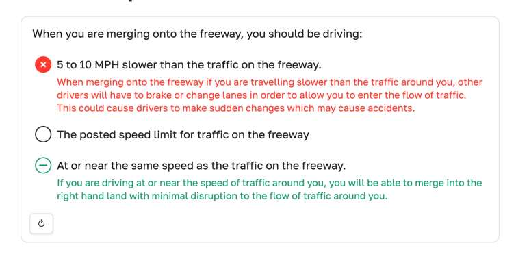
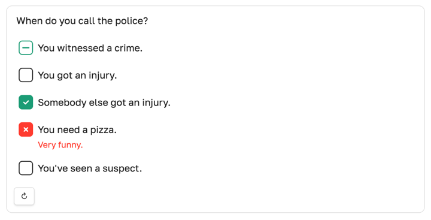
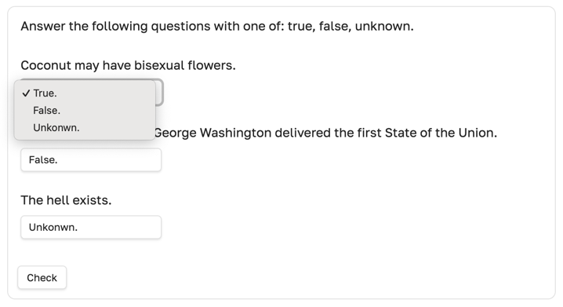
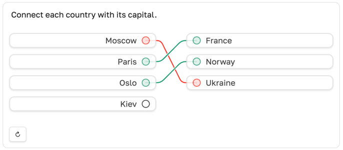

# Quiz blocks [](obsidian://show-plugin?id=quiz-blocks)

Render ` ```quiz ` code blocks into interactive multiple-choice quizzes directly inside Obsidian notes.


## How it works

You basically describe a quiz with a YAML code block.
The plugin transforms it into a nice interactive form.
Depending on the quiz type, one or multiple `options` can be selected.
There is a **Check** button that highlights right, wrong, and missed answers,
with optional `feedback` commentary. Great for self-education and learning notes.


## Supported quiz types

### `radio` — single correct option



<details><summary>show code</summary>

````yaml
```quiz
type: radio
content: >-
    When you are merging onto the freeway, you should be driving:

options:
- content: 5 to 10 MPH slower than the traffic on the freeway.
  feedback: When merging onto the freeway if you are travelling slower than the traffic around you, other drivers will have to brake or change lanes in order to allow you to enter the flow of traffic. This could cause drivers to make sudden changes which may cause accidents.

- content: The posted speed limit for traffic on the freeway
  feedback: The posted limit for any roadway is a limit and may not be a safe speed for traffic under current conditions. When merging into traffic, the most important thing is to be travelling at approximately the same speed as those around you so that you can join the flow of traffic with the least disruption.

- content: At or near the same speed as the traffic on the freeway.
  feedback: If you are driving at or near the speed of traffic around you, you will be able to merge into the right hand land with minimal disruption to the flow of traffic around you.
  correct: true
```
````

</details>

### `checkbox` — multiple correct options



<details><summary>show code</summary>

````yaml
```quiz
type: checkbox
content: >-
  When do you call the police?

options:
- content: You witnessed a crime.
  correct: true
- content: You got an injury.
- content: Somebody else got an injury.
  correct: true
- content: You need a pizza.
  feedback: Very funny.
- content: You've seen a suspect.
```
````

</details>

### `choice` — multiple questions sharing the same options



<details><summary>show code</summary>

````yaml
```quiz
type: choice
content: >-
  Answer the following questions with one of: true, false, unknown.

options:
- id: true
  content: True.
- id: false
  content: False.
- id: unknown
  content: Unkonwn.

questions:
- content: Coconut may have bisexual flowers.
  correct_option: true
- content: 1970 is the year when George Washington delivered the first State of the Union.
  correct_option: true
- content: The hell exists.
  correct_option: unknown
```
````

</details>

### `noodle` — multiple questions connected with options



<details><summary>show code</summary>

````yaml
```quiz
type: noodle
content: >-
  Connect each country with its capital.

options:
- content: Moscow
- content: Paris
- content: Oslo
- content: Kiev

questions:
- content: France
  correct: Paris

- content: Norway
  correct: Oslo

- content: Ukraine
  correct: Kiev
```
````

</details>

## Installation

~~Directly using this link: [`obsidian://show-plugin?id=quiz-blocks`](obsidian://show-plugin?id=quiz-blocks)~~

#### Install from Obsidian Community Plugins

<details><summary>show steps</summary>

1. Open **Obsidian**.
2. Go to **Settings → Community plugins**.
3. Make sure **Safe mode** is disabled.
4. Click **Browse**, search for **Quiz Blocks**.
5. Click **Install**, then **Enable**.
</details>

#### Install manually (from GitHub)

<details><summary>show steps</summary>

1. Download the latest release from the
   [GitHub releases page](https://github.com/xamgore/obsidian-quiz-blocks/releases).
2. Extract the downloaded ZIP file.
3. Copy the extracted folder into your vault’s plugin directory:
   `YOUR_VAULT/.obsidian/plugins/`
4. Restart Obsidian or go to **Settings → Community plugins** and click **Reload plugins**.
5. Enable **Quiz Blocks** from the list.
</details>


## Notes & limitations

- In source mode, quizzes are shown as YAML code blocks.
- Editor syntax highlighting doesn't work (help me!).
- Quiz blocks are rendered in preview/reading mode.
- Errors related to missing fields can be awkward.
- Chosen answers are kept until the page is closed.
- Two more quiz types are planned: free text.
- This is an early-stage plugin — feel free to open an issue and share feedback.


## Motivation

These are just a few examples of recurring requests and discussions in the Obsidian community around lightweight quiz functionality.

> [@amcasas:](https://forum.obsidian.md/t/quiz-type-plugin/2237) need some type of quiz function that you can add at the end of each note

> [@deleted:](https://www.reddit.com/r/ObsidianMD/comments/1ns1g7z/making_mcq_questions_in_obsidian/)
> in such a way that a maximum of one option is choosable for each question.

> [@30DayThrill:](https://www.reddit.com/r/ObsidianMD/comments/17lcsvf/quizzing_plugin_strategies_for_obsidian/)
> looking for a quizlet-esque solution where I can create more multiple choice or question and answer style tests.

If you find this plugin useful, please consider telling others about it or starring the repository&nbsp;⭐️

<br>
<br>
